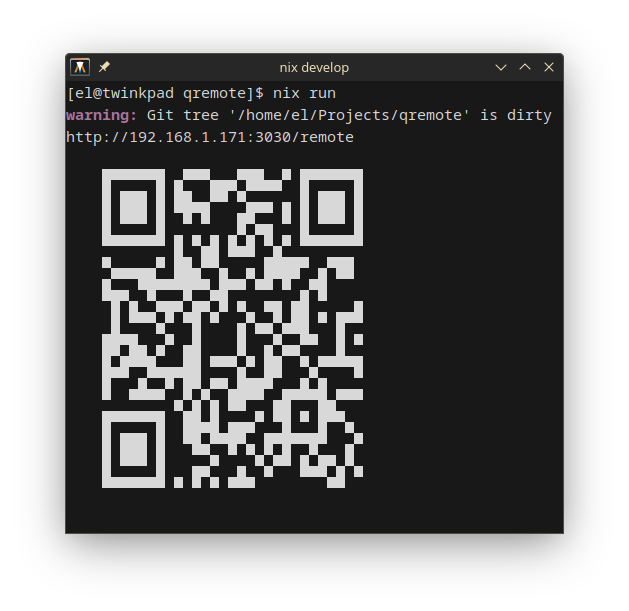
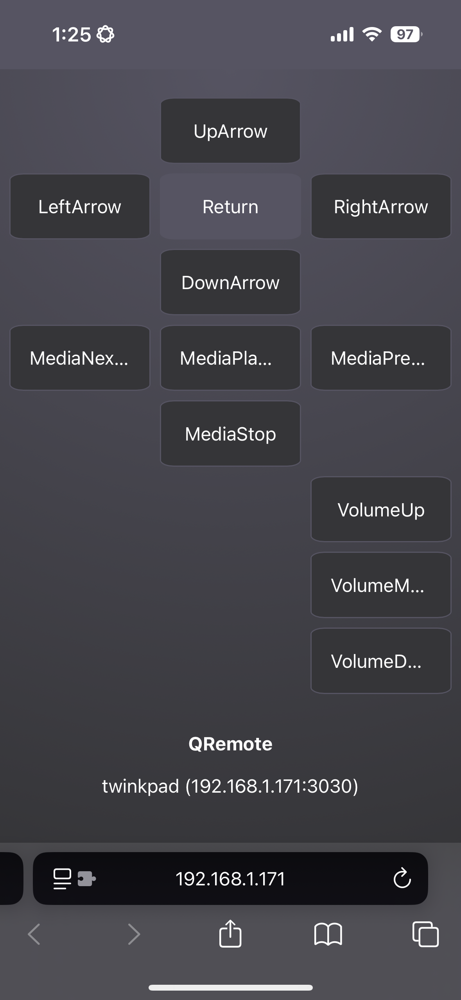

# QRemote

The year is 2014. You have a girl over. First time in a while. You were daring and said "Netflix and Chill?"... but you don't have Netflix. Instead, you're betting that you'll be able to find a good copy of _Birdman or (The Unexpected Virtue of Ignorance)_.

That bet did not pay off. The version you found has a funky audio track that requires you to keep adjusting the volume between the drumming and the audio.

Earlier this year you took Reddit's advice and bought a banging sound system with a cheap Class D amp. It sounds great, something to really brag about in the comments of Fantano's review for your 3rd favorite album of the year.

But it does not have a remote.

The volume must be adjusted manually on the dial right under your TV. This isn't typically a problem, but it _really is tonight_. The first couple of times you get up you're really self-conscious about it.

```
Don't look weird
Do I look weird doing this?
How do I bend down slightly without looking weird?
```

By the time of the movie's first preview of _What We Talk About When We Talk About Love_, it's clear that won't be talked about tonight between you.

The choice must be made whether to continue with this movie, or to pause it. But you know that pausing it is a gamble too. It requires you to _really bend over_ to reach your laptop which is barely hanging onto your PS4's HDMI cord.

Fear sets over you. This isn't what you wanted. You should have asked your roommate Darren to sign into his Mom's Netflix so you could watch _Moneyball_...

### The year is 2025 and we don't have to live like this anymore

## QRemote is

A multi-platform (Linux (X11/Wayland), macOS, and Windows) zero setup remote for any computer you're playing media on.

Simply run `qremote`, scan the QR code with your phone, and control your media right from your phone or other device's browser.

## Massive thank you to [Tooper](https://github.com/akleventis)

I completely jacked the idea for this project from [akleventis/lan_mac_remote](https://github.com/akleventis/lan_mac_remote). Thank you for showing it to me, sorry to Zuckerberg you

## How it works

QRemote starts a local web server (powered by [axum](https://crates.io/crates/axum)) which serves the remote's webpage and creates a WebSocket for I/O to be registered. When a remote button is pressed, the server uses [enigo](https://crates.io/crates/enigo) to simulate that input as the corresponding keyboard media key. Most players will respect keyboard media keys without any additional setup.

## Screenshots

Yes I am aware it is ugly rn

<p align="center">
    
    
</p>

## Attributions

Vectors and icons by <a href="https://github.com/mariuszostrowski/subway?ref=svgrepo.com" target="_blank">Mariusz Ostrowski</a> in CC Attribution License via <a href="https://www.svgrepo.com/" target="_blank">SVG Repo</a>
